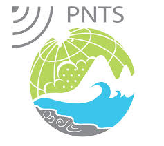

# PyGdalSAR
=======

Post-processing InSAR tool package written in the Python and Gdal programming language. It can be utilizes for predictives and empirical atmospheric corrections on the unwrapped interferograms, or time series correction from the ERA5 (ECMWF) or GACOS atmospheric models (ceg-research.ncl.ac.uk/v2/gacos/). Additional package for iterative spatial and temporal decompositions of geodetic Time Series (InSAR, GPS or Pixel Offsets) is available, as well as specific tools for the NSBAS processing chain and FLATSIM products (https://flatsim.cnes.fr/doi/?lang=fr): raster or time series plotting and cleaning of interferograms, radar to geographic conversions, script to filter, flatten, and re-unwrap all interferograms, atmospheric or empircal corrections, manipulate list of interferograms, compute unwrapping coverage, convert Real4 files (.r4) to Gtiff...



To download the package
=============
```git clone https://github.com/simondaout/PyGdalSAR.git```

To update the software: 
```git pull```

In case of fire:
```
git commit
git push
leave building
```

Requirements
=============
This project needs the following external components:
 * CMake
 * Python-3.* 
 * Gdal (https://www.gdal.org)
 * NSBAS (optional): http://efidir.poleterresolide.fr/index.php/effidir-tools/nsbas


Installation
=============

* The majortiy of the scripts are written in python and do not need installation. Just add them to your PATH. If you are using module, an example of modulefile is available in /contrib/modulefile/pygdalsar

* Some C and Fortran components can be installed with CMake (<http://www.cmake.org>). To build and install:
cmake -S . -B bin
cmake --build bin

Setting specific compilers is also done the usual CMake way, for example to
use gcc, gfortran and python2.7 as C, Fortran, an python compilers, do:

  $ cmake -DCMAKE\_C\_COMPILER=/home/daouts/.guix-profile/bin/gcc -DCMAKE\_Fortran\_COMPILER=/home/daouts/.guix-profile/bin/gfortran -S . -B bin
  $ cmake -DPYTHON\_EXECUTABLE=/opt/local/bin/python2.7 -DCMAKE\_C\_COMPILER=gcc -DCMAKE\_Fortran\_COMPILER=gfortran -S . -B bin


Organisation
=============
This project contains the following folders (add all those directories to your $PATH):
 * TimeSeries: scripts for time series decomposition and analysis 
 * AtmoCorr: scripts for atmospehric corrections.
 * Plots: plotting programms for .tiff, .r4, time series or .unw files
 * GeoTools: Tools for geographic corrections: tie InSAR to GPS,  decompse several LOS to horizontal/vertical directions 
 * NSBAS-playground: Loads of scripts and Tools specific for NSBAS 
 * tutorial: 
 	 * ReversibleDeformation: example GACOS corrections, empirical phase/topo corrections and extraction of reversible derformations with seasonal functions.
 	 * Vector: in progress
 * contrib/python: additional python-package for parsing nsbas or gamma files, or colormaps for plots (add this dir to your $PYTHONPATH). 

 * Pyrocko: Tools for Pyrocko (https://pyrocko.org/, https://git.pyrocko.org/pyrocko)

Developpers & Contact
=============
```
Simon Daout: simon.daout@univ-lorraine.fr
Associate Professor, CRPG, NANCY
```

```
Collaborators:  
Louise Maubant: louise.maubant@univ-grenoble-alpes.fr
Marie-Pierre Doin: marie-pierre.doin@univ-grenoble-alpes.fr
Mathieu Volat: matthieu.volat@univ-lyon1.fr
Nicholas Dodds: nicholas.dodds@st-annes.ox.ac.uk
```
 References
============

The following package is openly available for everyone, but please cite us: 

* [Daout, Simon, et al. "Large‐scale InSAR monitoring of permafrost freeze‐thaw cycles on the Tibetan Plateau." Geophysical Research Letters 44.2 (2017): 901-909](https://agupubs.onlinelibrary.wiley.com/doi/abs/10.1002/2016GL070781)

* [Daout, S., Sudhaus, H., Kausch, T., Steinberg, A., & Dini, B. (2019). Interseismic and postseismic shallow creep of the North Qaidam Thrust faults detected with a multitemporal InSAR analysis. Journal of Geophysical Research: Solid Earth, 124(7), 7259-7279.](https://agupubs.onlinelibrary.wiley.com/doi/full/10.1029/2019JB017692)


* [Maubant, L., Pathier, E., Daout, S., Radiguet, M., Doin, M. P., Kazachkina, E., ... & Walpersdorf, A. (2020). Independent component analysis and parametric approach for source separation in InSAR time series at regional scale: application to the 2017–2018 Slow Slip Event in Guerrero (Mexico). Journal of Geophysical Research: Solid Earth, 125(3), e2019JB018187.](https://agupubs.onlinelibrary.wiley.com/doi/full/10.1029/2019JB018187)

* [Dodds, N., Daout, S., Walker, R. T., Begenjev, G., Bezmenov, Y., Mirzin, R., & Parsons, B. (2022). Interseismic deformation and strain-partitioning along the Main Köpetdag Fault, Turkmenistan, with Sentinel-1 InSAR time-series. Geophysical Journal International, 230(3), 1612-1629.](https://academic.oup.com/gji/article/230/3/1612/6568902?login=true)
